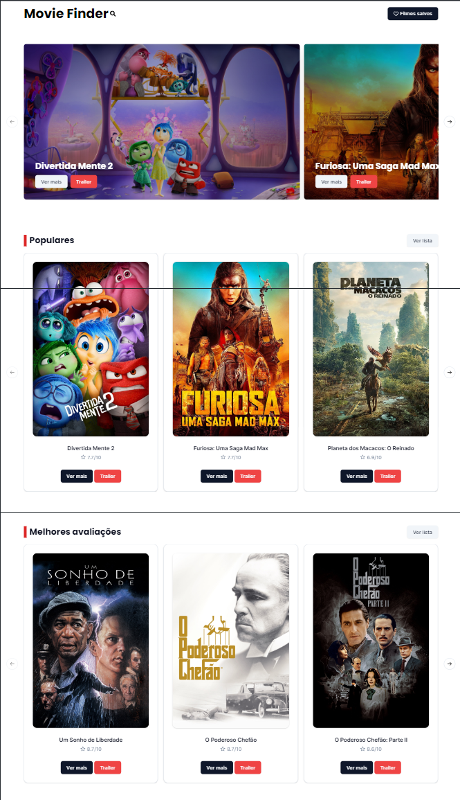

<div align="center" style='margin-top:6rem;'>

# Movie Finder

  <br />
  <a href="#about"><strong>Explore the screenshots »</strong></a>
  <br />
  <br />
  <a href="https://github.com/raphaeleliass/movie-finder/issues/new?assignees=&labels=bug&template=01_BUG_REPORT.md&title=bug%3A+">Report a Bug</a>
  ·
  <a href="https://github.com/raphaeleliass/movie-finder/issues/new?assignees=&labels=enhancement&template=02_FEATURE_REQUEST.md&title=feat%3A+">Request a Feature</a>
  .
  <a href="https://github.com/raphaeleliass/movie-finder/issues/new?assignees=&labels=question&template=04_SUPPORT_QUESTION.md&title=support%3A+">Ask a Question</a>
</div>

<div align="center">
<br />

[](LICENSE)

[](https://github.com/raphaeleliass/movie-finder/issues?q=is%3Aissue+is%3Aopen+label%3A%22help+wanted%22)
[](https://github.com/raphaeleliass)

</div>

<details open="open">
<summary>Table of Contents</summary>

- [About](#about)
  - [Built With](#built-with)
- [Getting Started](#getting-started)
  - [Prerequisites](#prerequisites)
  - [Installation](#installation)
- [Authors & contributors](#authors--contributors)
- [License](#license)

</details>

---

## Descrição

O projeto Movie Finder permite que os usuários descubram os lançamentos mais recentes de filmes, filmes mais bem avaliados e filmes populares no momento. Este aplicativo utiliza a API do TMDB para fornecer informações atualizadas e uma experiência de navegação perfeita para os entusiastas de cinema.

> Você pode acessar o site clicando [aqui](https://raphaelelias-moviefinder.vercel.app)

## Capturas de Tela

<details>
<summary>Veja as capturas de tela do projeto</summary>

<br>

<div align='center'>

### Desktop

  
  
  ### Mobile
  
</div>

</details>

### Construído Com

> - React JS
> - TypeScript
> - React Router
> - Tailwindcss
> - Shadcn UI

## Começando

### Pré-requisitos

> - NodeJS

### Instalação

>O primeiro passo é criar uma conta no site [TMDB](https://tmdb.org) e gerar sua chave api.

>Depois, <strong>na pasta raiz</strong> do projeto, crie um arquivo .env com as seguintes variáveis: 

```bash
VITE_API_KEY='coloque sua chave api aqui'
VITE_BASE_URL=https://api.themoviedb.org/3/
 ```

> Em seguida, execute o seguinte comando no terminal do projeto para instalar as dependências:

```bash
npm install
```

> Por fim, é só executar o seguinte comando e pronto!

```bash
npm run dev
```

## License

This project is licensed under the **MIT license**.

See [LICENSE](LICENSE) for more information.
